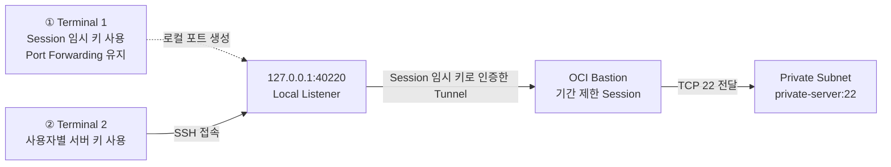

> ✅
> **이 가이드는 SSH Port Forwarding Session을 기본 접속 방식으로 사용한다.** 
> 
> OCI 공식 보안 권고에 따라 Bastion Session을 생성할 때마다 새로운 임시 SSH 키 쌍을 생성한다. Terminal 1은 Session 임시 키로 터널을 유지하고, Terminal 2는 passphrase 보호 사용자 키로 `private-server`에 접속한다.
> 
> 
{: .prompt-info }

## 1. 개요
### 1.1 목적

본 가이드에서는 별도의 Bastion 서버 인스턴스를 운영하지 않고 **OCI Bastion 서비스의 SSH Port Forwarding Session**을 사용해 Private Subnet의 Linux 인스턴스에 접속한다.

인스턴스 생성 시 내려받은 OCI 개인키는 최초 설정에서 사용자별 공개키를 등록할 때만 사용한다. 대상 서버 인증에는 사용자별 passphrase 보호 Ed25519 키를 사용하며, Bastion Session 인증에는 Session마다 새로 생성한 임시 키를 사용한다. 임시 Session 키는 다른 Session에서 재사용하지 않고 Session 종료 후 폐기한다.


> 🔐
> 파일 확장자와 파일명은 보안 기능이 아니다. 
> 핵심 보안 요소는 **개인키 passphrase, 사용자별 서버 키, Session별 임시 키, Client CIDR 제한, 기간 제한 Session, 최소 포트 허용, 키 회수 절차**이다.
{: .prompt-warning }

### 1.2 현재 실습 환경

| **항목** | **내용** |
| --- | --- |
| 작성·실습 기준 | macOS Terminal |
| 지원 실행 환경 | macOS·Linux Terminal 또는 Windows PowerShell |
| 대상 인스턴스 | `private-server` |
| 네트워크 | OCI Private Subnet |
| 대상 포트 | SSH TCP 22 |
| 최초 접속 키 | 인스턴스 생성 시 OCI Console에서 내려받은 PEM 개인키 |
| 대상 서버 인증 키 | 사용자별 Passphrase 보호 Ed25519 키 또는 정책상 필요한 RSA 4096 키 |
| Bastion Session 인증 키 | Session을 생성할 때마다 OCI Console에서 새로 발급받고 종료 후 폐기하는 임시 SSH 키 |
| 접속 방식 | OCI Bastion SSH Port Forwarding Session |

`private-server`에는 Public IP를 할당하지 않고 인터넷에서 직접 SSH 접속하지 않는다.<br>
인스턴스 생성 시 사용한 공개키는 대상 OS 사용자의 `authorized_keys`에 등록되어 있으므로, 내려받은 개인키로 대상 서버 인증을 수행할 수 있다.

### 1.3 Port Forwarding을 선택하는 이유

| **비교 항목** | **SSH Port Forwarding** | **Managed SSH** |
| --- | --- | --- |
| 대상 | 접근 가능한 Private IP 또는 특정 TCP 포트 | OCI Compute 인스턴스 |
| Oracle Cloud Agent | 필요하지 않음 | 필요함 |
| Bastion Plugin | 필요하지 않음 | 활성화 및 정상 실행 필요 |
| 접속 과정 | 터널 생성 후 로컬 포트에 다시 SSH 접속 | OCI가 제공한 명령으로 대상 OS에 직접 접속 |
| 적합한 환경 | 일반 Linux 서버, DB, RDP 또는 Agent 요구사항을 충족하지 않는 인스턴스 | Agent와 Plugin이 정상 구성된 OCI Compute |

현재 실습은 기존 OCI 키로 최초 접속한 뒤 사용자별 신규 키로 교체하는 과정까지 다루므로 Port Forwarding이 더 범용적이고 환경 의존성이 낮다.<br>
대상 인스턴스에서 Oracle Cloud Agent와 Bastion Plugin이 정상 실행되고 단일 SSH 명령 접속을 우선하는 환경에서는 Managed SSH Session을 선택할 수 있다. 본 가이드에서는 SSH Port Forwarding Session만 다룬다.

### 1.4 전체 접속 구조



1. Session을 생성할 때마다 Bastion 인증용 임시 SSH 키 쌍을 새로 만든다.
2. **Terminal 1**은 임시 Session 개인키로 OCI Bastion에 인증하고 로컬 포트 `40220`과 `private-server:22`를 연결한다.
3. **Terminal 2**는 사용자별 서버 개인키로 `127.0.0.1:40220`에 접속한다.
4. 대상 서버의 `sshd`는 `authorized_keys`에 등록된 사용자별 공개키로 Terminal 2를 인증한다.
5. 작업 종료 후 Bastion Session과 임시 키 쌍을 폐기한다.

## 2. 사전 요구사항
### 2.1 로컬 OpenSSH Client 확인
이 가이드는 운영체제와 관계없이 OpenSSH의 `ssh`, `ssh-keygen`, `ssh-add` 명령을 사용한다.<br>
본문에는 macOS·Linux 명령을 기본으로 표시하고, Windows PowerShell 명령은 같은 단계의 접힌 토글에서 제공한다.<br>
PuTTY는 별도의 PPK 변환과 화면 절차가 필요하므로 본문에서는 다루지 않는다.<br>


Terminal에서 OpenSSH Client를 확인한다.

```bash
ssh -V
command -v ssh
command -v ssh-keygen
```

- Windows PowerShell에서 실행하는 경우
    PowerShell에서 OpenSSH Client를 확인한다.
    
    ```powershell
    ssh -V
    Get-Command ssh
    Get-Command ssh-keygen
    ```
    
    명령을 찾을 수 없으면 **설정 → 시스템 → 선택적 기능**에서 OpenSSH Client를 설치한다. 관리자 PowerShell에서는 다음 명령으로 설치 상태를 확인하고 설치할 수 있다.
    
    ```powershell
    Get-WindowsCapability -Online |
      Where-Object Name -Like 'OpenSSH.Client*'
    
    Add-WindowsCapability -Online -Name OpenSSH.Client~~~~0.0.1.0
    ```
    

    > ℹ️
    > 접속을 수행하는 PC에는 **OpenSSH Client**만 필요하다. Windows PC에 OpenSSH Server를 설치하거나 TCP 22 인바운드 방화벽을 열 필요는 없다.
    {: .prompt-info }
    

### 2.2 키 역할과 기본 경로

| **키 역할** | **macOS·Linux 예시** | **수명 주기** |
| --- | --- | --- |
| OCI 최초 접속 키 | `~/.ssh/private-server-oci-initial` | 최초 사용자 키 등록 후 비활성화 |
| 사용자별 서버 키 | `~/.ssh/private-server-ed25519-<KEY_OWNER>` | 사용자 권한과 함께 관리·회수 |
| Bastion Session 임시 키 | `~/.ssh/BstLabPri01-session-<KEY_OWNER>-<TIMESTAMP>` | OCI Console에서 Session마다 새로 발급받고 종료 후 폐기 |


> 🏷️
> `<KEY_OWNER>`는 `opc`, `ubuntu` 같은 서버 OS 계정이 아니라 실제 키 소유자의 계정명으로 교체한다. Windows에서는 같은 파일명을 `$HOME\\.ssh\\` 아래에 사용한다.
{: .prompt-info }

### 2.3 대상 인스턴스 확인
다음 항목을 OCI Console에서 확인한다.
- 인스턴스 이름이 `private-server`인지 확인한다.
- 인스턴스 상태가 **Running**인지 확인한다.
- 대상 Private IP를 기록한다.
- Public IP가 할당되지 않았는지 확인한다.
- 이미지에 맞는 OS 사용자를 확인한다. Oracle Linux은 일반적으로 `opc`, Ubuntu는 일반적으로 `ubuntu`를 사용한다.
- 대상 서버에서 SSH 서비스가 TCP 22를 수신하는지 확인한다.

### 2.4 Bastion 네트워크 및 권한 확인

- Bastion은 `private-server`와 동일한 VCN에 연결한다.
- Bastion이 연결된 Subnet에서 대상 Subnet으로 TCP 22 통신이 가능해야 한다.
- 대상 NSG 또는 Security List는 Bastion에서 들어오는 TCP 22만 허용한다.
- Bastion의 Client CIDR Allowlist에는 사용자 PC가 사용하는 승인된 공인 IP를 `/32`로 등록한다.
- `0.0.0.0/0`을 Client CIDR로 사용하지 않는다.
- 사용자 또는 그룹에는 Bastion과 Session 생성에 필요한 최소 IAM 권한만 부여한다.

Port Forwarding Session은 대상 리소스에 Oracle Cloud Agent 또는 Bastion Plugin이 없어도 사용할 수 있다. 단, 대상 Linux 서버에서 SSH 서비스가 실행 중이어야 한다.

## 3. 사용자별 SSH 키 생성
### 3.1 최초 설정과 이후 접속 구분
기존 OCI 키를 사용하는 교체 절차는 최초 설정에서 한 번만 수행한다.<br>
기존 키는 신규 공개키를 등록하기 위한 초기 접속 수단으로 사용하고, 신규 사용자 키로 새 연결이 성공할 때까지 활성 상태로 유지한다.

| **단계** | **사용 키** | **처리 기준** |
| --- | --- | --- |
| 최초 설정 | 기존 OCI 키와 신규 사용자 키 | 신규 키 검증 후 기존 공개키 행을 주석 처리함 |
| 이후 접속 | Session 임시 키와 사용자별 서버 키 | Session 임시 키는 Bastion 터널 인증에 사용하고, 사용자별 서버 키는 대상 서버 인증에 사용함 |


> ⚠️
> 기존 공개키는 신규 키로 **새 연결**이 성공한 뒤에만 주석 처리한다. 기존 연결이 유지되는 것만으로는 신규 키가 검증된 것이 아니다.
{: .prompt-warning }

### 3.2 키 알고리즘 선택

| **알고리즘** | **사용 기준** | **생성 옵션** |
| --- | --- | --- |
| Ed25519 | 기본 권장 방식이다. 키가 짧고 성능과 보안성이 우수하다. | `-t ed25519 -a 100` |
| RSA 4096 | 구형 시스템 또는 조직의 호환성 정책 때문에 Ed25519를 사용할 수 없을 때 선택한다. | `-t rsa -b 4096 -o -a 100` |

### 3.3 신규 Ed25519 키 생성

```bash
KEY_OWNER="<KEY_OWNER>"
USER_KEY="$HOME/.ssh/private-server-ed25519-${KEY_OWNER}"
KEY_COMMENT="${KEY_OWNER}@private-server"

mkdir -p "$HOME/.ssh"
chmod 700 "$HOME/.ssh"

ssh-keygen -t ed25519 -a 100 \
  -C "$KEY_COMMENT" \
  -f "$USER_KEY"
<Passphrase 입력>
<Passphrase 재입력>

chmod 600 "$USER_KEY"
chmod 644 "$USER_KEY.pub"
ssh-keygen -lf "$USER_KEY.pub"
```


키 생성 명령을 실행하면 다음 프롬프트가 표시된다. 충분히 강하고 재사용하지 않는 passphrase를 두 번 입력한다.

```
Enter passphrase (empty for no passphrase):
Enter same passphrase again:
```


> 🔐
> Passphrase 입력 중에는 화면에 문자나 별표가 표시되지 않는다. 정상 동작이므로 입력을 계속한다. 첫 번째 프롬프트에서 Enter만 눌러 빈 passphrase로 생성하지 않는다.
{: .prompt-info }

- Windows PowerShell에서 실행하는 경우
    
    ```powershell
    $KeyOwner = '<KEY_OWNER>'
    $UserKey = Join-Path $HOME ".ssh\private-server-ed25519-$($KeyOwner)"
    $SshDirectory = Split-Path $UserKey
    $KeyComment = "$KeyOwner@private-server"
    
    New-Item -ItemType Directory -Force $SshDirectory | Out-Null
    ssh-keygen -t ed25519 -a 100 `
      -C $KeyComment `
      -f $UserKey
    
    $CurrentIdentity = [System.Security.Principal.WindowsIdentity]::GetCurrent().Name
    & icacls.exe $UserKey /inheritance:r
    & icacls.exe $UserKey /grant:r "${CurrentIdentity}:(F)"
    ssh-keygen -lf "$UserKey.pub"
    ```
    

### 3.4 RSA 4096 대안

Ed25519를 허용하지 않는 호환성 정책이 있을 때만 다음 명령으로 RSA 4096 키를 생성한다.<br>
이후 절차의 키 경로는 `private-server-rsa4096-<KEY_OWNER>`로 바꿔 사용한다.

```bash
KEY_OWNER="<KEY_OWNER>"
RSA_USER_KEY="$HOME/.ssh/private-server-rsa4096-${KEY_OWNER}"
KEY_COMMENT="${KEY_OWNER}@private-server"

ssh-keygen -t rsa -b 4096 -o -a 100 \
  -C "$KEY_COMMENT" \
  -f "$RSA_USER_KEY"
chmod 600 "$RSA_USER_KEY"
chmod 644 "$RSA_USER_KEY.pub"
```

- Windows PowerShell에서 실행하는 경우
    
    ```powershell
    $KeyOwner = '<KEY_OWNER>'
    $RsaKey = Join-Path $HOME ".ssh\private-server-rsa4096-$($KeyOwner)"
    $KeyComment = "$KeyOwner@private-server"
    ssh-keygen -t rsa -b 4096 -o -a 100 `
      -C $KeyComment `
      -f $RsaKey
    ```
    

### 3.5 기존 OCI 개인키 작업본 준비

원본 PEM을 직접 변경하지 않고 `.ssh` 디렉터리에 최초 접속용 작업본을 만든다.<br>
`<OCI_PRIVATE_KEY_FILE>.pem`은 내려받은 실제 파일명으로 교체한다.

```bash
KEY_SOURCE="$HOME/Downloads/<OCI Private Key명>.pem"
OCI_INITIAL_KEY="$HOME/.ssh/private-server-oci-initial"

# Private Key 복사
cp "$KEY_SOURCE" "$OCI_INITIAL_KEY"
chmod 600 "$OCI_INITIAL_KEY"

# Public Key 생성
ssh-keygen -y -f "$OCI_INITIAL_KEY" \
  > "$OCI_INITIAL_KEY.pub"
chmod 644 "$OCI_INITIAL_KEY.pub"

ssh-keygen -lf "$OCI_INITIAL_KEY.pub"
```


- Windows PowerShell에서 실행하는 경우
    
    ```powershell
    $KeySource = Join-Path $HOME 'Downloads\<OCI_PRIVATE_KEY_FILE>.pem'
    $OciInitialKey = Join-Path $HOME '.ssh\private-server-oci-initial'
    
    Copy-Item -LiteralPath $KeySource -Destination $OciInitialKey
    $CurrentIdentity = [System.Security.Principal.WindowsIdentity]::GetCurrent().Name
    & icacls.exe $OciInitialKey /inheritance:r
    & icacls.exe $OciInitialKey /grant:r "${CurrentIdentity}:(F)"
    ssh-keygen -y -f $OciInitialKey |
      Set-Content -Encoding ascii "$OciInitialKey.pub"
    ssh-keygen -lf "$OciInitialKey.pub"
    ```
    
    기존 OCI 개인키에는 passphrase를 새로 추가하지 않는다. 이 키는 신규 키 등록과 검증이 완료될 때까지만 제한적으로 사용한 뒤 조직 정책에 따라 회수한다.
    

### 3.6 개인키 보호 기준

- 신규 개인키와 passphrase를 서로 다른 통제 수단으로 관리한다.
- 개인키는 사용자 별로 발급하고 팀 공용 개인키를 만들지 않는다.
- 개인키를 Bastion 또는 대상 서버에 복사하지 않는다.
- 개인키를 클라우드 동기화 폴더, 공유 폴더 또는 소스 저장소에 저장하지 않는다.
- 키 파일명이나 확장자를 보안 통제로 간주하지 않는다.


> 🚫
> 개인키 본문과 passphrase는 Wiki, 블로그, 이메일, 메신저, 티켓 또는 스크립트에 기록하지 않는다. 캡처 화면에도 개인키 본문과 passphrase를 포함하지 않는다.
{: .prompt-warning }

### 3.7 Bastion Session 키와 서버 사용자 키의 관계
Port Forwarding은 다음 두 인증을 독립적으로 수행한다.

| **인증 구간** | **사용 키** | **공개키 등록 위치** |
| --- | --- | --- |
| Terminal 1 → OCI Bastion Session | Session별 임시 키 | OCI Console의 **Generate SSH key pair**로 Session 생성 시 등록 |
| Terminal 2 → `private-server` | 사용자별 서버 키 | 대상 사용자의 `authorized_keys` |

OCI Bastion은 Port Forwarding Session에서 대상 서버의 SSH 사용자 인증을 대신하지 않는다.<br>
Terminal 1은 임시 Session 키로 Bastion에 인증하고, Terminal 2는 터널을 통과해 사용자별 서버 키로 `private-server`의 `sshd`에 인증한다.


✅
OCI 공식 보안 가이드는 새 Bastion Session마다 새로운 임시 SSH 키 쌍을 생성하고 이전 Session 키를 재사용하지 않도록 권고한다.<br>
[OCI - Securing Bastion](https://docs.oracle.com/en-us/iaas/Content/Security/Reference/bastion_security.htm)
{: .prompt-info }

## 4. OCI Bastion 생성
### 4.1 Client CIDR 확인
사용자 PC가 외부로 통신할 때 사용하는 공인 IP를 확인하고 단일 주소를 `/32`로 등록한다.

```
예시: 203.0.113.10/32
```

VPN, 사내 Proxy 또는 네트워크 변경으로 공인 IP가 바뀌면 Bastion Allowlist도 변경해야 한다.

### 4.2 Bastion 생성

1. OCI Console에서 **Identity & Security → Bastion**으로 이동한다.
2. **Create bastion**을 선택한다.
3. Bastion 이름을 입력한다. 예: `BastionLabPri`
4. `private-server`가 속한 VCN을 선택한다.
5. 대상 Subnet 또는 대상 Subnet과 통신 가능한 Subnet을 선택한다.
6. Client CIDR Allowlist에 승인된 공인 IP `/32`를 입력한다.
    
    
7. 업무에 필요한 최대 Session TTL을 설정한다. (세션 당 최대 TTL, 최대 3시간)
    
    
8. Bastion을 생성하고 상태가 **Active**인지 확인한다.
    
    

### 4.3 대상 서버의 Ingress 규칙 확인

`private-server`에 연결된 NSG 또는 Subnet Security List에서 Bastion으로부터 TCP 22 접근을 허용한다.

| **항목** | **설정 예시** |
| --- | --- |
| Source | Bastion의 Private Endpoint IP `/32` 
또는 승인된 Bastion Subnet CIDR |
| IP Protocol | TCP |
| Destination Port | 22 |
| Description | Allow SSH from OCI Bastion |

가능하면 넓은 Subnet CIDR보다 Bastion의 정확한 Private Endpoint IP를 Source로 사용한다.


## 5. SSH Port Forwarding Session 생성
### 5.1 Session 생성 및 임시 키 발급
1. 생성한 Bastion을 선택한다.
2. **Sessions 탭 → Create session**을 선택한다.
    
    
3. Session type에서 **SSH port forwarding session**을 선택한다.
4. Session 이름을 입력한다. 예: `private-server-ssh-<KEY_OWNER>-<TIMESTAMP>`
5. Target host에서 인스턴스 이름 또는 IP 주소 입력 방식을 선택한다.
6. 대상 인스턴스로 `private-server` 또는 해당 Private IP를 지정한다.
7. 대상 포트에 `22`를 입력한다.
    
    
8. **Add SSH key → Generate SSH key pair**를 선택한다. 기존 공개키 파일을 선택하거나 붙여 넣지 않는다.
9. **Save private key**와 **Save public key**를 선택해 이번 Session의 키 쌍을 내려받는다.
    
    
10. 업무에 필요한 최소 TTL을 설정한다. OCI Session TTL은 30분 이상 180분 이하로 설정한다.
    
    
11. Session을 생성한다.

> ⚠️
> 개인키는 키 생성 화면을 벗어난 뒤 다시 내려받을 수 없으므로 안전한 로컬 위치에 저장한다.<br>
> 사용자별 서버 키인 `private-server-ed25519-<KEY_OWNER>`는 Session 생성 화면에 선택하거나 업로드하지 않는다.
{: .prompt-warning }

### 5.2 내려받은 Session 키 보관

다운로드한 키를 `.ssh` 디렉터리로 옮기고 `<Bastion명>-session-<사용자명>-<생성시각>` 구조로 이름을 변경한다.

```bash
KEY_OWNER="<KEY_OWNER>"
SESSION_STAMP="$(date +%Y%m%d%H%M%S)"
BASTION_SESSION_KEY="$HOME/.ssh/BstLabPri01-session-${KEY_OWNER}-${SESSION_STAMP}"

mkdir -p "$HOME/.ssh"
chmod 700 "$HOME/.ssh"
mv "$HOME/Downloads/<OCI_SESSION_PRIVATE_KEY_FILE>" "$BASTION_SESSION_KEY"
mv "$HOME/Downloads/<OCI_SESSION_PUBLIC_KEY_FILE>" "$BASTION_SESSION_KEY.pub"
chmod 600 "$BASTION_SESSION_KEY"
chmod 644 "$BASTION_SESSION_KEY.pub"
ssh-keygen -lf "$BASTION_SESSION_KEY.pub"
```


- Windows PowerShell에서 실행하는 경우
    
    ```powershell
    $KeyOwner = '<KEY_OWNER>'
    $SessionStamp = Get-Date -Format 'yyyyMMddHHmmss'
    $BastionSessionKey = Join-Path $HOME ".ssh\BstLabPri01-session-${KeyOwner}-${SessionStamp}"
    
    New-Item -ItemType Directory -Force (Split-Path $BastionSessionKey) | Out-Null
    Move-Item -LiteralPath "$HOME\Downloads\<OCI_SESSION_PRIVATE_KEY_FILE>" -Destination $BastionSessionKey
    Move-Item -LiteralPath "$HOME\Downloads\<OCI_SESSION_PUBLIC_KEY_FILE>" -Destination "$BastionSessionKey.pub"
    
    $CurrentIdentity = [System.Security.Principal.WindowsIdentity]::GetCurrent().Name
    & icacls.exe $BastionSessionKey /inheritance:r
    & icacls.exe $BastionSessionKey /grant:r "${CurrentIdentity}:(F)"
    ssh-keygen -lf "$BastionSessionKey.pub"
    ```
    


> 🔐
> Passphrase를 적용하는 키는 `private-server`에 등록하는 **사용자별 장기 서버 키**이다.<br>
> OCI Console에서 발급받은 Session 임시 키는 짧은 TTL, 제한된 파일 권한, Session별 1회 사용과 종료 후 삭제로 보호한다.
{: .prompt-warning }

### 5.3 Session 활성화 및 명령 복사
Session 상태가 **Active**가 될 때까지 기다린다. Session 메뉴에서 **Copy SSH command**를 선택한다.


복사한 명령에서 다음 자리표시자만 변경한다.

- `<privateKey>`: OCI Console에서 내려받은 **Session 임시 개인키** 경로를 사용한다. 5.2에서 정리한 macOS·Linux의 `$BASTION_SESSION_KEY` 또는 Windows PowerShell의 `$BastionSessionKey`로 치환한다.
- `<localPort>`: 사용하지 않는 로컬 포트. 본 가이드에서는 로컬 포트로 `40220`을 사용한다.


> ✅
> Region, Session OCID, Bastion Host와 대상 정보는 수기로 다시 작성하지 않고 OCI Console의 **Copy SSH command**를 기준으로 사용한다.
{: .prompt-info }

## 6. 최초 설정: 서버 사용자 키 전환
이 절차는 `private-server`를 처음 구성할 때 한 번만 수행한다. Terminal 1은 5장에서 OCI Console로 발급받은 Session 임시 키로 Bastion 터널을 열고, Terminal 2는 기존 OCI 초기 키로 서버에 접속해 사용자별 서버 공개키를 추가한다.

### 6.1 Session 임시 키로 Terminal 1 터널 생성
OCI Console의 **Copy SSH command**를 우선 사용한다. `<BASTION_SESSION_PRIVATE_KEY_PATH>`를 5.2에서 정리한 실제 Session 개인키 경로로 교체한다.

```bash
BASTION_SESSION_KEY="<BASTION_SESSION_PRIVATE_KEY_PATH>"
LOCAL_PORT="40220"
SESSION_OCID="<SESSION_OCID>"
REGION="<REGION>"
TARGET_PRIVATE_IP="<TARGET_PRIVATE_IP>"

ssh -i "$BASTION_SESSION_KEY" \
  -o IdentitiesOnly=yes \
  -o ExitOnForwardFailure=yes \
  -N -L "${LOCAL_PORT}:${TARGET_PRIVATE_IP}:22" \
  -p 22 "${SESSION_OCID}@host.bastion.${REGION}.oci.oraclecloud.com"
```


- Windows PowerShell에서 실행하는 경우
    
    ```powershell
    $BastionSessionKey = '<BASTION_SESSION_PRIVATE_KEY_PATH>'
    $LocalPort = 40220
    $SessionOcid = '<SESSION_OCID>'
    $Region = '<REGION>'
    $TargetPrivateIp = '<TARGET_PRIVATE_IP>'
    
    ssh -i $BastionSessionKey `
      -o IdentitiesOnly=yes `
      -o ExitOnForwardFailure=yes `
      -N -L "${LocalPort}:${TargetPrivateIp}:22" `
      -p 22 "${SessionOcid}@host.bastion.${Region}.oci.oraclecloud.com"
    ```
    


> 🔑
> Terminal 1에서는 5.2에서 정리한 **OCI 발급 Session 임시 개인키**를 사용한다.<br>
> 사용자별 서버 키의 passphrase를 이 단계에 입력하지 않는다.
{: .prompt-info }

### 6.2 기존 OCI 키로 Terminal 2 최초 접속
`<OS_USER>`는 Oracle Linux이면 일반적으로 `opc`, Ubuntu이면 일반적으로 `ubuntu`를 사용한다.

```bash
ssh -i "$HOME/.ssh/private-server-oci-initial" \
  -o IdentitiesOnly=yes \
  -o HostKeyAlias=private-server \
  -p 40220 "<OS_USER>@127.0.0.1"
```

- Windows PowerShell에서 실행하는 경우
    
    ```powershell
    ssh -i "$HOME\.ssh\private-server-oci-initial" `
      -o IdentitiesOnly=yes `
      -o HostKeyAlias=private-server `
      -p 40220 "<OS_USER>@127.0.0.1"
    ```
    


### 6.3 사용자별 서버 공개키 등록
로컬(별도 세션)에서 사용자별 서버 공개키 한 줄과 지문을 확인한다.

```bash
cat "$HOME/.ssh/private-server-ed25519-<KEY_OWNER>.pub"
ssh-keygen -lf "$HOME/.ssh/private-server-ed25519-<KEY_OWNER>.pub"
```


- Windows PowerShell에서 실행하는 경우
    
    ```powershell
    Get-Content "$HOME\.ssh\private-server-ed25519-<KEY_OWNER>.pub"
    ssh-keygen -lf "$HOME\.ssh\private-server-ed25519-<KEY_OWNER>.pub"
    ```
    

기존 OCI 키로 접속한 `private-server`에서 다음 명령을 실행한다. `<NEW_PUBLIC_KEY_ONE_LINE>`을 사용자별 서버 공개키 한 줄로 교체한다.

```bash
# .ssh/authorized_keys 파일 확인
ls -l $HOME/.ssh/authorized_keys

# 기존 authorized_keys 파일 백업
cp "$HOME/.ssh/authorized_keys" \
  "$HOME/.ssh/authorized_keys.$(date +%Y%m%d%H%M%S).bak"

NEW_PUBLIC_KEY='<NEW_PUBLIC_KEY_ONE_LINE>'
grep -qxF "$NEW_PUBLIC_KEY" "$HOME/.ssh/authorized_keys" || \
  printf '%s\n' "$NEW_PUBLIC_KEY" >> "$HOME/.ssh/authorized_keys"

ssh-keygen -lf "$HOME/.ssh/authorized_keys"
```


> ℹ️
> 이 공개키는 `private-server`의 사용자 인증용이다.<br>
> OCI Bastion Session에는 등록하지 않는다.
{: .prompt-warning }

### 6.4 사용자별 서버 키로 새 연결 검증
Terminal 1과 기존 OCI 키로 접속한 Terminal 2를 그대로 유지하고 Terminal 3을 새로 연다.

```bash
ssh -i "$HOME/.ssh/private-server-ed25519-<KEY_OWNER>" \
  -o IdentitiesOnly=yes \
  -o HostKeyAlias=private-server \
  -p 40220 "<OS_USER>@127.0.0.1"
  
Enter passphrase for key '/Users/haksu/.ssh/private-server-ed25519-haksu': 
```


- Windows PowerShell에서 실행하는 경우
    
    ```powershell
    ssh -i "$HOME\.ssh\private-server-ed25519-<KEY_OWNER>" `
      -o IdentitiesOnly=yes `
      -o HostKeyAlias=private-server `
      -p 40220 "<OS_USER>@127.0.0.1"
    ```
    

### 6.5 기존 OCI 공개키 주석 처리
사용자별 서버 키의 새 연결이 성공한 뒤에만 진행한다. 먼저 기존 OCI 공개키의 Base64 필드와 지문을 확인한다.

```bash
awk '{print $2}' "$HOME/.ssh/private-server-oci-initial.key.pub"
ssh-keygen -lf "$HOME/.ssh/private-server-oci-initial.key.pub"
```


- Windows PowerShell에서 실행하는 경우
    
    ```powershell
    $LegacyPublicKey = Get-Content "$HOME\.ssh\private-server-oci-initial.pub"
    $LegacyPublicKey.Split()[1]
    ssh-keygen -lf "$HOME\.ssh\private-server-oci-initial.pub"
    ```
    

Terminal 3에서 `<OCI_PUBLIC_KEY_BASE64_FIELD>`를 확인한 Base64 필드로 교체하고 기존 키 행을 주석 처리한다.

```bash
# 기존 OCI SSH Key 등록 확인
OLD_KEY_BLOB='<OCI_PUBLIC_KEY_BASE64_FIELD>'

grep -nF "$OLD_KEY_BLOB" "$HOME/.ssh/authorized_keys"
cp "$HOME/.ssh/authorized_keys" \
  "$HOME/.ssh/authorized_keys.before-oci-key-disable.bak"

awk -v key="$OLD_KEY_BLOB" '
  index($0, key) && $0 !~ /^[[:space:]]*#/ {
    print "# DISABLED_OCI_INITIAL_KEY " $0
    next
  }
  { print }
' "$HOME/.ssh/authorized_keys" \
  > "$HOME/.ssh/authorized_keys.next"

chmod 600 "$HOME/.ssh/authorized_keys.next"
mv "$HOME/.ssh/authorized_keys.next" "$HOME/.ssh/authorized_keys"
grep -nF "$OLD_KEY_BLOB" "$HOME/.ssh/authorized_keys"
ssh-keygen -lf "$HOME/.ssh/authorized_keys"
```


기존 OCI 키 행이 `# DISABLED_OCI_INITIAL_KEY`로 시작하고 사용자별 서버 키 지문이 활성 상태로 남아 있는지 확인한다. 사용자별 서버 키로 새 연결을 한 번 더 열어 최종 검증한다.

### 6.6 최초 설정 종료 및 Session 임시 키 폐기
1. 사용자별 서버 키로 최종 새 연결이 성공했는지 재확인한다.
    
    
2. 기존 OCI 키로 접속한 Terminal 2와 검증용 Terminal 3을 종료한다.
3. Terminal 1에서 `Control + C`를 눌러 터널을 종료한다. (Port Forwarding 세션 종료)
4. OCI Console에서 Bastion Session을 삭제하거나 만료 상태를 확인한다.
5. 다음 명령으로 이번 Session의 임시 개인키와 공개키 경로를 확인한 뒤 삭제한다.

```bash
test -n "$BASTION_SESSION_KEY" && \
  ls -l "$BASTION_SESSION_KEY" "$BASTION_SESSION_KEY.pub"

rm -f -- "$BASTION_SESSION_KEY" "$BASTION_SESSION_KEY.pub"
unset BASTION_SESSION_KEY
```


- Windows PowerShell에서 실행하는 경우
    
    ```powershell
    Get-Item $BastionSessionKey, "$BastionSessionKey.pub"
    Remove-Item -LiteralPath $BastionSessionKey, "$BastionSessionKey.pub"
    Remove-Variable BastionSessionKey
    ```
    

> ⚠️
> 삭제 전에 변수에 이번 Session의 임시 키 경로가 설정되어 있는지 반드시 확인한다. 사용자별 서버 키와 OCI 초기 키를 삭제 대상으로 지정하지 않는다.
{: .prompt-warning }

1. 기존 OCI 개인키는 조직 정책에 따라 승인된 복구 저장소로 이관하거나 안전하게 폐기한다.

## 7. 이후 접속 절차
최초 서버 사용자 키 전환이 완료된 뒤에는 기존 OCI 키를 사용하지 않는다. **접속할 때마다 OCI Console에서 새로운 Bastion Session 임시 키를 발급받고, 대상 서버에는 기존 사용자별 서버 키로 인증한다.**

### 7.1 새 Session과 임시 키 발급

1. OCI Console 내 Bastion 서비스에서 Port Forwarding Session을 만들면서 **Generate SSH key pair**를 선택한다.
    
    

2. 이전 Session 키나 사용자별 서버 공개키를 업로드하지 않는다. 생성한 Session에 SSH 명령을 복사한다.
    
    
    

### 7.2 Terminal 1에서 터널 생성

```bash
BASTION_SESSION_KEY="<BASTION_SESSION_PRIVATE_KEY_PATH>"
LOCAL_PORT="40220"
SESSION_OCID="<SESSION_OCID>"
REGION="<REGION>"
TARGET_PRIVATE_IP="<TARGET_PRIVATE_IP>"

ssh -i "$BASTION_SESSION_KEY" \
  -N -L "${LOCAL_PORT}:${TARGET_PRIVATE_IP}:22" \
  -p 22 "${SESSION_OCID}@host.bastion.${REGION}.oci.oraclecloud.com"
```


- Windows PowerShell에서 실행하는 경우
    
    ```powershell
    $BastionSessionKey = '<BASTION_SESSION_PRIVATE_KEY_PATH>'
    $LocalPort = 40220
    $SessionOcid = '<SESSION_OCID>'
    $Region = '<REGION>'
    $TargetPrivateIp = '<TARGET_PRIVATE_IP>'
    
    ssh -i $BastionSessionKey `
      -o IdentitiesOnly=yes `
      -o ExitOnForwardFailure=yes `
      -N -L "${LocalPort}:${TargetPrivateIp}:22" `
      -p 22 "${SessionOcid}@host.bastion.${Region}.oci.oraclecloud.com"
    ```
    

Terminal 1에서는 OCI Console에서 내려받은 이번 Session 임시 개인키로 터널을 생성하고, 터널이 필요한 동안 창을 열어 둔다.

### 7.3 Terminal 2에서 private-server 접속

```bash
ssh -i "$HOME/.ssh/private-server-ed25519-<KEY_OWNER>" \
  -p 40220 "<OS_USER>@127.0.0.1"
```


- Windows PowerShell에서 실행하는 경우
    
    ```powershell
    ssh -i "$HOME\.ssh\private-server-ed25519-<KEY_OWNER>" `
      -o IdentitiesOnly=yes `
      -o HostKeyAlias=private-server `
      -p 40220 "<OS_USER>@127.0.0.1"
    ```
    


> 🚫
> Terminal 1의 Port Forwarding 세션을 종료하면, Terminal 2의 세션도 종료된다.
{: .prompt-warning }

### 7.4 접속 종료와 임시 키 폐기

1. 대상 서버에서 `hostname`과 `whoami`를 확인한다.
2. Terminal 2에서 `exit`를 실행한다.
3. Terminal 1에서 `Control + C`를 눌러 터널을 종료한다.
4. OCI Console에서 Session을 삭제하거나 만료 상태를 확인한다.
5. 6.6의 명령을 사용해 이번 Session의 임시 개인키와 공개키를 삭제한다.


✅
다음 접속에서는 기존 임시 키를 재사용하지 않고 7.1의 Session SSH Key 발급부터 다시 시작한다.
(사용자별 서버 키는 계속 사용한다.)
{: .prompt-info }

## 8. 선택 사항: SSH Agent 활용


> ℹ️
> 이 장은 필수 접속 절차가 아닌 보조 기능이다. 본 가이드의 기본 방식은 Terminal 2에서 사용자별 서버 개인키를 지정하고 해당 키의 passphrase를 직접 입력해 `private-server`에 접속하는 것이다.
{: .prompt-info }

### 8.1 기능 개요

SSH Agent를 사용하면 사용자별 서버 개인키를 Agent에 등록할 때 passphrase를 한 번 입력하고, 이후 같은 로그인 Session에서는 반복 입력을 줄일 수 있다. 키의 passphrase가 제거되거나 서버 인증 방식이 바뀌는 것은 아니다.

SSH Agent를 사용한 뒤에도 7.3의 Terminal 2 접속 명령을 그대로 사용한다. Agent가 등록된 키를 사용할 수 있으면 passphrase 프롬프트가 생략될 수 있다.

Bastion Session 임시 키는 OCI Console에서 Session마다 새로 발급받고 종료 후 폐기하므로 SSH Agent나 Keychain에 등록하지 않는다.

### 8.2 사용자별 서버 키 등록

- macOS·Linux에서 사용하는 경우
    
    macOS에서 Keychain 저장이 조직 정책상 허용되면 다음과 같이 등록한다.
    
    ```bash
    ssh-add --apple-use-keychain "$HOME/.ssh/private-server-ed25519-<KEY_OWNER>"
    ssh-add -l
    ```
    
    Keychain 저장이 허용되지 않거나 Linux를 사용하면 현재 SSH Agent에만 등록한다.
    
    ```bash
    ssh-add "$HOME/.ssh/private-server-ed25519-<KEY_OWNER>"
    ssh-add -l
    ```
    
- Windows PowerShell에서 사용하는 경우
    
    SSH Agent 서비스가 실행 중인지 확인한 뒤 사용자별 서버 키를 등록한다.
    
    ```powershell
    Get-Service ssh-agent
    ssh-add "$HOME\.ssh\private-server-ed25519-<KEY_OWNER>"
    ssh-add -l
    ```
    
    서비스가 중지되어 있으면 조직 정책을 확인한 뒤 관리자 PowerShell에서 시작한다.
    
    ```powershell
    Get-Service ssh-agent | Set-Service -StartupType Manual
    Start-Service ssh-agent
    ```
    

### 8.3 사용 시 주의사항

- SSH Agent 사용 여부와 관계없이 개인키에는 강한 passphrase를 유지한다.
- 사용자별 서버 키만 Agent에 등록하고 Bastion Session 임시 키는 등록하지 않는다.
- SSH Agent Forwarding은 활성화하지 않는다.
- 개인키를 OCI Bastion이나 `private-server`에 복사하지 않는다.
- 공용 PC나 신뢰할 수 없는 장비에서는 SSH Agent 또는 Keychain에 키를 등록하지 않는다.

사용이 끝난 사용자별 서버 키를 Agent에서 제거하려면 다음 명령을 사용한다.<br>

macOS·Linux:

```bash
ssh-add -d "$HOME/.ssh/private-server-ed25519-<KEY_OWNER>"
```

Windows PowerShell:

```powershell
ssh-add -d "$HOME\.ssh\private-server-ed25519-<KEY_OWNER>"
```


✅
SSH Agent는 편의 기능이다. 설정하지 않아도 7장의 기본 접속 절차를 그대로 수행할 수 있다.
{: .prompt-info }

## 9. 보안 운영 기준
### 9.1 핵심 보안 확인사항

- [ ]  `private-server`에 Public IP를 할당하지 않음
- [ ]  Bastion Client CIDR을 승인된 사용자 공인 IP 또는 최소 범위로 제한함
- [ ]  대상 서버의 TCP 22는 Bastion Private Endpoint에서 오는 통신만 허용함
- [ ]  Bastion Session TTL을 업무에 필요한 최소 시간으로 설정함
- [ ]  Session마다 **Generate SSH key pair**로 임시 키를 새로 발급하고, 종료 후 Session과 내려받은 키 쌍을 폐기함
- [ ]  사용자별 서버 키에는 강한 passphrase를 적용하고 개인키를 다른 사용자와 공유하지 않음
- [ ]  신규 사용자 키로 별도의 새 연결을 검증한 후 기존 OCI 공개키를 비활성화함
- [ ]  Bastion과 Session의 생성·삭제 이력을 OCI Audit에서 확인함

### 9.2 키 역할 분리

```
Session별 임시 Bastion 키
├─ 키 쌍: OCI Console의 Generate SSH key pair로 발급
├─ 개인키: 로컬에 내려받아 Terminal 1에서만 사용
└─ Session 종료 후 내려받은 키 쌍 폐기

사용자별 서버 키
├─ 공개키: private-server의 authorized_keys에 등록
├─ 개인키: Terminal 2에서 사용
└─ 사용자 권한과 함께 관리·회수
```

팀 공용 개인키를 장기간 공유하지 않는다. Session 임시 키로 대상 서버에 로그인하지 않고, 사용자별 서버 키를 Bastion Session에서 재사용하지 않는다.

### 9.3 기존 OCI 키 비활성화와 보관

사용자별 서버 키의 새 연결이 성공하고 기존 OCI 공개키를 주석 처리한 뒤 최종 새 연결까지 확인한다. 기존 개인키 원본과 작업본은 조직 정책에 따라 승인된 암호화 복구 저장소에 보관하거나 안전하게 폐기한다.

암호화되지 않은 OCI 개인키를 Downloads, OneDrive, iCloud Drive, 공유 폴더 또는 휴지통에 장기간 남겨두지 않는다. 공개키 비활성화 시점, 담당자, 사용자별 서버 키 지문과 검증 결과를 변경 기록에 남긴다.

## 10. 문제 해결


> 🧭
> **오류가 발생한 단계를 먼저 구분한다.**
> Terminal 1 실패 → Bastion Session, 임시 키와 Client CIDR을 확인한다.
> Terminal 1 정상·Terminal 2 실패 → 사용자별 서버 키와 `authorized_keys`를 확인한다.
> Terminal 2 Timeout → 터널 상태와 네트워크 규칙을 확인한다.
> Terminal 2 Connection refused → 대상 SSH 서비스와 포트를 확인한다.
{: .prompt-info }

### 10.1 Terminal 1에서 Bastion 터널이 생성되지 않음

- Bastion Session이 **Active**인지 확인한다.
- 사용자 PC의 현재 공인 IP가 Bastion Client CIDR Allowlist에 포함되는지 확인한다.
- OCI Console의 **Copy SSH command**를 기준으로 명령을 작성했는지 확인한다.
- 현재 Session의 **Generate SSH key pair**에서 내려받은 개인키를 `BASTION_SESSION_KEY`로 지정했는지 확인한다.
- 이전 Session의 임시 키나 사용자별 서버 키를 지정하지 않았는지 확인한다.
- 사내 방화벽 또는 Proxy가 Bastion Endpoint로 나가는 TCP 22 통신을 차단하는지 확인한다.

`-N`으로 터널을 실행하면 Terminal 1은 별도의 Shell을 표시하지 않고 대기 상태를 유지한다. 오류 없이 명령이 계속 실행되고 있다면 정상일 수 있으므로 창을 닫지 않는다.

상세 확인이 필요하면 OCI Console에서 복사한 명령의 `ssh` 다음에 `-v`를 추가한다. OCI 공식 안내에 따라 `-vv` 또는 `-vvv`는 사용하지 않는다. 로그에는 접속 정보가 포함될 수 있으므로 전체 내용을 Wiki나 블로그에 게시하지 않는다.

### 10.2 로컬 포트가 이미 사용 중임

`Address already in use`가 표시되면 로컬 포트 `40220`을 다른 프로세스가 사용 중인지 확인한다.

- macOS·Linux:
    
    ```bash
    lsof -nP -iTCP:40220 -sTCP:LISTEN
    ```
    
- Windows PowerShell:
    
    ```powershell
    Get-NetTCPConnection -LocalPort 40220 -State Listen -ErrorAction SilentlyContinue
    ```
    

기존 프로세스를 확인한 뒤 사용하지 않는 다른 로컬 포트로 변경한다. 예를 들어 `22022` 또는 `28022`를 사용할 수 있다.


> ⚠️
> Terminal 1의 `-L` 옵션에 지정한 로컬 포트와 Terminal 2의 `-p` 옵션에 지정한 포트는 반드시 같아야 한다.
{: .prompt-warning }

### 10.3 사용자별 서버 키 인증 또는 전환에 실패함

Terminal 2에서 `Permission denied (publickey)`가 표시되면 다음 항목을 확인한다.

- 대상 OS 사용자명이 올바른지 확인한다. Oracle Linux는 일반적으로 `opc`, Ubuntu는 일반적으로 `ubuntu`를 사용한다.
- 최초 접속에서는 `private-server-oci-initial`, 전환 후 접속에서는 `private-server-ed25519-<KEY_OWNER>`를 지정했는지 확인한다.
- 사용자별 신규 공개키가 접속 대상 OS 사용자의 `~/.ssh/authorized_keys`에 한 줄로 등록되어 있는지 확인한다.
- 로컬 공개키와 `authorized_keys`에 등록된 공개키의 지문이 일치하는지 확인한다.
- 대상 사용자가 `~/.ssh`와 `authorized_keys`를 소유하는지 확인한다.
- `~/.ssh` 권한은 `700`, `authorized_keys` 권한은 `600`인지 확인한다.
- `authorized_keys` 백업본과 현재 파일을 비교해 신규 키가 누락되거나 잘못 주석 처리되지 않았는지 확인한다.


> 🚨
> 신규 사용자 키로 별도의 새 연결이 성공하기 전에는 기존 OCI 공개키를 비활성화하지 않는다.<br>
> 기존 OCI 키로 연결된 Terminal도 신규 키 검증이 끝날 때까지 유지한다.
{: .prompt-warning }

### 10.4 Timeout 또는 Connection refused 발생

**Timeout이 발생하는 경우**

- Terminal 1의 터널이 계속 실행 중인지 확인한다.
- Terminal 1과 Terminal 2에서 동일한 로컬 포트를 사용하는지 확인한다.
- Session 대상 Private IP와 대상 포트가 올바른지 확인한다.
- 대상 Subnet의 NSG 또는 Security List가 Bastion Private Endpoint에서 `private-server:22`로 들어오는 통신을 허용하는지 확인한다.

**Connection refused가 발생하는 경우**

- Session에서 대상 포트를 `22`로 지정했는지 확인한다.
- `private-server`에서 SSH 서비스가 실행 중인지 확인한다.
- SSH 서비스가 TCP 22에서 수신 중인지 확인한다.
- 이미지 또는 조직 정책에 따라 SSH 포트를 변경했다면 Session 대상 포트도 같은 값으로 설정한다.

### 10.5 개인키 파일 오류가 발생함

`Load key ...: invalid format`이 표시되면 파일 손상, 잘못된 줄바꿈 또는 다른 키 파일을 지정했는지 확인한다.

**Bastion Session 임시 키 오류**

- 현재 Session의 **Generate SSH key pair**에서 내려받은 개인키인지 확인한다.
- 사용자별 서버 키를 Terminal 1에 지정하지 않았는지 확인한다.
- Session 임시 개인키가 손상되거나 분실되었다면 기존 키를 복구하려 하지 않고 새로운 Session과 키 쌍을 발급한다.

**사용자별 서버 키 오류**

macOS·Linux:

```bash
chmod 600 "$HOME/.ssh/private-server-ed25519-<KEY_OWNER>"
ssh-keygen -y -f "$HOME/.ssh/private-server-ed25519-<KEY_OWNER>"
```

Windows PowerShell:

```powershell
$UserKey = "$HOME\.ssh\private-server-ed25519-<KEY_OWNER>"
ssh-keygen -y -f $UserKey
```

사용자별 서버 키의 passphrase를 분실하면 기존 개인키에서 복구할 수 없다. 기존 OCI 키나 정상 연결을 유지한 상태에서 새로운 사용자 키를 생성하고, 신규 공개키 등록과 새 연결 검증을 완료한 뒤 기존 공개키를 회수한다.

상세한 OCI Bastion 오류 기준은 [OCI - Problems Connecting to a Session](https://docs.oracle.com/en-us/iaas/Content/Bastion/Tasks/troubleshooting_connect_session_failed.htm)을 참고한다.

## 11. 공식 참고 자료

- [OCI - Securing Bastion](https://docs.oracle.com/en-us/iaas/Content/Security/Reference/bastion_security.htm)
- [OCI - Creating a Port Forwarding Session](https://docs.oracle.com/en-us/iaas/Content/Bastion/Tasks/create-session-port-forwarding.htm)
- [OCI - Connecting to a Port Forwarding Session](https://docs.oracle.com/en-us/iaas/Content/Bastion/Tasks/connect-port-forwarding.htm)
- [OCI - Creating a Bastion](https://docs.oracle.com/en-us/iaas/Content/Bastion/Tasks/create-bastion.htm)
- [OCI - Connecting to Sessions in Bastion](https://docs.oracle.com/en-us/iaas/Content/Bastion/Tasks/connectingtosessions.htm)
- [OCI - Creating a Managed SSH Session](https://docs.oracle.com/en-us/iaas/Content/Bastion/Tasks/create-session-managed-ssh.htm)
- [OCI - Managing Key Pairs on Linux Instances](https://docs.oracle.com/en-us/iaas/Content/Compute/Tasks/managingkeypairs.htm)
- [Oracle Linux - Using the SSH Key Agent to Remember Passphrases](https://docs.oracle.com/en/operating-systems/oracle-linux/openssh/openssh-UsingtheSSHKeyAgenttoRememberPassphrases.html)
- [Microsoft - Get started with OpenSSH for Windows](https://learn.microsoft.com/en-us/windows-server/administration/openssh/openssh_install_firstuse)
- [Microsoft - Key-Based Authentication in OpenSSH for Windows](https://learn.microsoft.com/en-us/windows-server/administration/openssh/openssh_keymanagement)